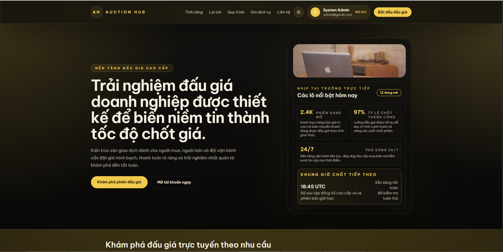
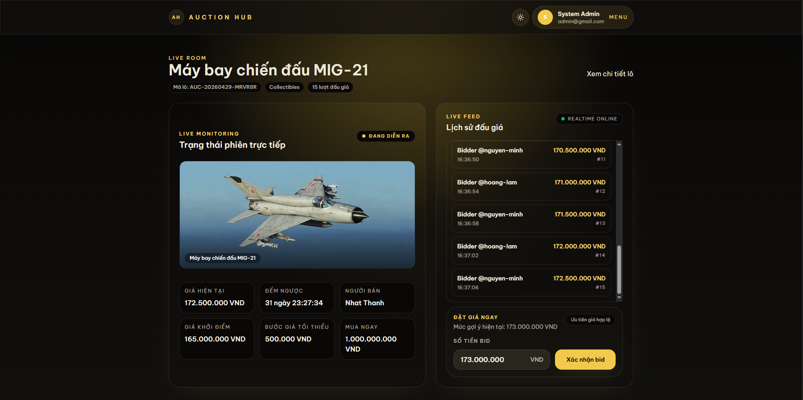

# Auction Hub

A modern, real-time auction platform for buying and selling items online.

🔗 **[View Live Demo →](https://vinabid.store/)**

## Screenshots

<div align="center">
  
  <br />
  
</div>

## Features

- ⚡ **Real-time Bidding** - Live auction updates via WebSocket (sub-second latency)
- 🔐 **Secure Authentication** - JWT-based auth with password hashing
- 💳 **Wallet System** - Built-in balance and transaction management
- 📸 **Image Management** - AWS S3 integration for product images
- 📊 **Admin Dashboard** - Complete auction and user management
- 🔄 **Background Jobs** - BullMQ for asynchronous processing
- 📱 **Responsive Design** - Mobile-first UI with TailwindCSS
- 🏷️ **Category System** - Organize auctions by categories
- 🎯 **Auction Lifecycle** - Complete state management (pending → active → ended)
- 🔔 **Real-time Notifications** - Instant updates for bids and auction changes

## Tech Stack

**Backend:**

- [NestJS](https://nestjs.com/) - Progressive Node.js framework
- [PostgreSQL](https://www.postgresql.org/) - Relational database
- [Prisma](https://www.prisma.io/) - ORM
- [Socket.io](https://socket.io/) - Real-time communication
- [Redis](https://redis.io/) - Caching & pub/sub
- [BullMQ](https://bullmq.io/) - Job queue
- [AWS S3](https://aws.amazon.com/s3/) - Cloud storage

**Frontend:**

- [Next.js](https://nextjs.org/) - React framework
- [React 19](https://react.dev/) - UI library
- [TailwindCSS](https://tailwindcss.com/) - Styling
- [TanStack Query](https://tanstack.com/query/) - Server state management
- [Socket.io Client](https://socket.io/docs/v4/client-api/) - Real-time updates

**DevOps:**

- [Docker](https://www.docker.com/) - Containerization
- [Turbo](https://turbo.build/) - Monorepo management
- [GitLab CI](https://about.gitlab.com/product/continuous-integration/) - CI/CD

## Quick Start

### Prerequisites

- Node.js >= 18
- PostgreSQL >= 14
- Redis
- Docker (optional)

### Installation

```bash
# Clone repository
git clone <repository-url>
cd auction-hub

# Install dependencies
npm install

# Setup environment
cp apps/api/.env.example apps/api/.env
cp apps/web/.env.example apps/web/.env.local

# Setup database
npm run db:generate
npm run db:migrate

# Start development servers
npm run dev
```

**Access:**

- Frontend: http://localhost:3000
- API: http://localhost:4000

## Development

```bash
# Start all services
npm run dev

# Start specific service
npm run dev --filter=api
npm run dev --filter=web

# Build all
npm run build

# Run linting
npm run lint

# Database
npm run db:generate
npm run db:migrate
npm run db:studio
```

## Project Structure

```
auction-hub/
├── apps/
│   ├── api/              # NestJS backend
│   ├── web/              # Next.js frontend
│   └── worker/           # Background job service
├── packages/
│   ├── db/               # Database & Prisma schema
│   └── shared/           # Shared types & utilities
├── infra/                # Docker compose files
└── docker-compose.prod.yml
```

## Contributing

Contributions are welcome! Please follow these steps:

1. Fork the repo
2. Create a feature branch (`git checkout -b feature/amazing-feature`)
3. Commit your changes (`git commit -m 'Add amazing feature'`)
4. Push to the branch (`git push origin feature/amazing-feature`)
5. Open a Pull Request

## License

UNLICENSED - All rights reserved

## Contact

For questions or support, reach out via GitHub issues or [visit the live demo](https://vinabid.store/)

---
